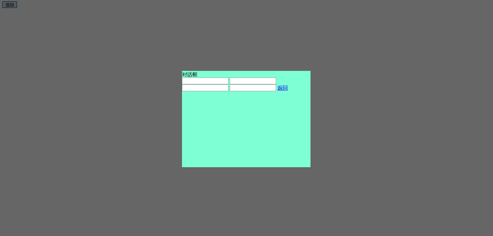
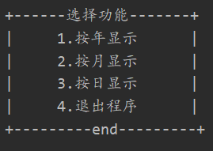
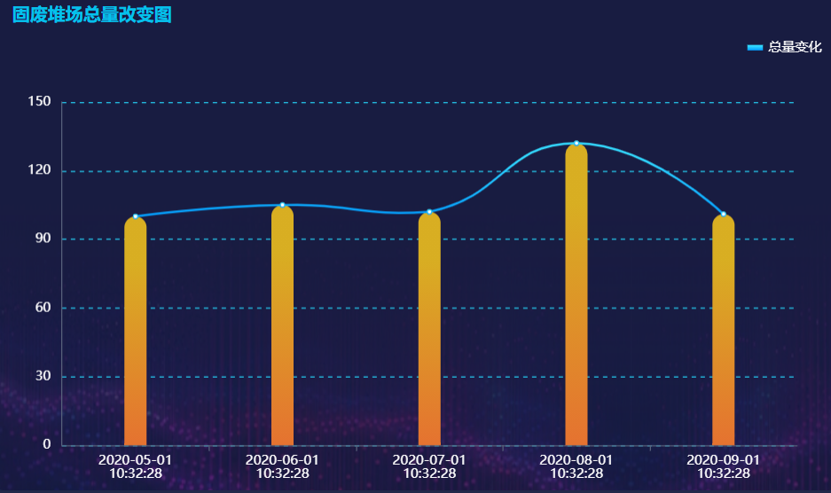
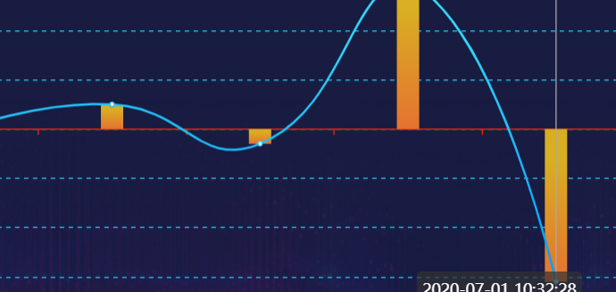

## 已经解决的问题

1. 界面大致布局
2. 插入echarts
3. 用示例数据测试

目前主要在静态网页

## 亟待解决的问题

1. 增添一个对话框，可以选择按照 “按月查询” “按年查询” “按日查询”  并在绘图区域中绘制对应时间的统计图。

   

   

2. 绘图区域可以随时间移动（用shift）

   [ECharts 异步加载数据](https://www.runoob.com/echarts/echarts-ajax-data.html)

   

3. 数据从数据库动态提取

## 细节更改

1. 日志动态提取更新

2. 图片制作成轮播图或者插入视频

3. 变化图柱状图正负值-动态设置圆角样式

   [echarts柱状图负值-动态设置圆角样式](https://blog.csdn.net/EnidChann/article/details/109312962)

   

4. 字体大小以及右边部分边界调整

